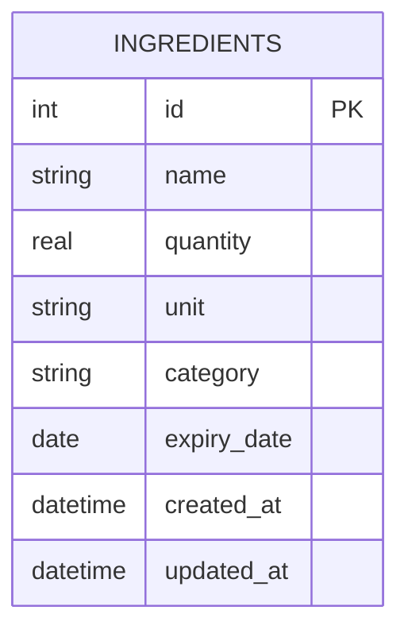

# SmartFridge 資料庫設計

本文件詳細記錄了 SmartFridge 系統的資料庫結構設計，包含實體關係圖（ER 圖）、資料表詳細說明。

## 1. ER 圖（實體關係圖）

目前 MVP 階段主要管理使用者的食材庫存狀態，因此核心資料表為 `ingredients`。

## 2. 資料表詳細說明

### `ingredients` (食材資料表)

記錄冰箱內所有的食材庫存狀態與到期日。

| 欄位名稱 | 型別 | 必填 | 預設值 | 說明 |
| :--- | :--- | :--- | :--- | :--- |
| `id` | INTEGER | 是 | (Auto Increment) | Primary Key (主鍵)，食材的唯一識別碼 |
| `name` | TEXT | 是 | 無 | 食材名稱 (例：蘋果、牛肉) |
| `quantity` | REAL | 是 | 無 | 剩餘數量 (例：1.5, 3) |
| `unit` | TEXT | 是 | 無 | 數量單位 (例：顆, kg, ml) |
| `category` | TEXT | 否 | 無 | 食材分類 (例：水果, 肉類, 蔬菜) |
| `expiry_date` | DATE | 是 | 無 | 到期日 (YYYY-MM-DD 格式) |
| `created_at` | DATETIME | 是 | CURRENT_TIMESTAMP | 建立時間 |
| `updated_at` | DATETIME | 是 | CURRENT_TIMESTAMP | 最後更新時間 |

## 3. SQL 建表語法與 Model 程式碼

- SQL 建表語法位於：`database/schema.sql`
- Python Model 程式碼位於：`app/models/ingredient.py`
