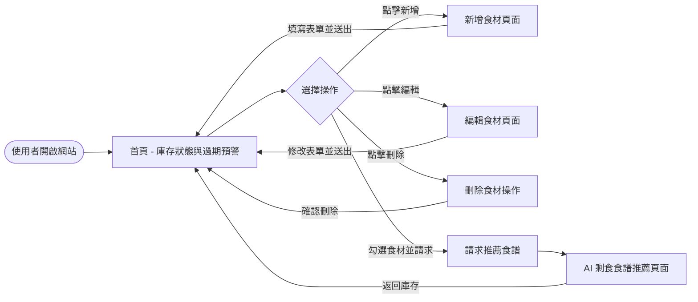
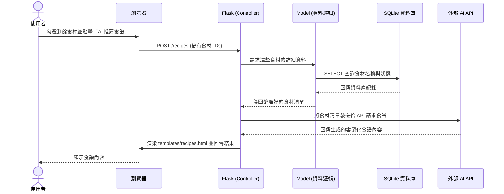

# SmartFridge 系統與使用者流程圖

本文件視覺化了 SmartFridge 系統的使用者操作路徑（User Flow）以及系統內部的資料流互動（Sequence Diagram）。

## 1. 使用者流程圖（User Flow）

描述使用者從進入系統到執行各項核心操作（新增食材、編輯、刪除、尋找食譜）的完整路徑。

## 2. 系統序列圖（Sequence Diagram）

以下示範系統中最具代表性的流程：「**使用者勾選食材並請求 AI 推薦食譜**」的系統內部互動過程。

## 3. 功能清單對照表

統整 MVP 範圍內的所有主要功能與對應的路由設計。

| 功能名稱 | URL 路徑 | HTTP 方法 | 說明 |
| :--- | :--- | :--- | :--- |
| 首頁 (庫存列表與預警) | `/` | GET | 顯示所有食材，高亮即將過期的項目 |
| 新增食材頁面 | `/ingredient/add` | GET | 顯示新增食材的輸入表單 |
| 處理新增食材 | `/ingredient/add` | POST | 將使用者送出的表單資料存入資料庫 |
| 編輯食材頁面 | `/ingredient/edit/<id>` | GET | 讀取特定食材資料並顯示編輯表單 |
| 處理編輯食材 | `/ingredient/edit/<id>` | POST | 將修改後的食材資料更新至資料庫 |
| 刪除食材 | `/ingredient/delete/<id>` | POST | 執行刪除特定食材的動作 |
| AI 剩食食譜推薦 | `/recipes` | POST | 接收選定的食材，呼叫 AI 並顯示推薦食譜 |
